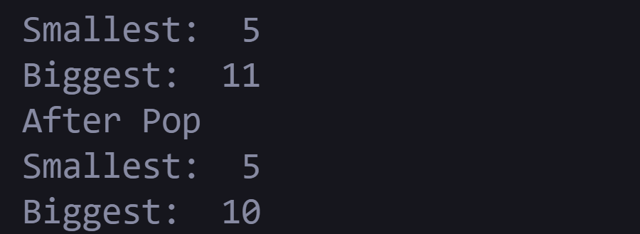

🔰 Level 1: Custom Data Structure implementation
Design a stack that supports the following operations in O(1) time and O(n) space:
push(x): Pushes element x onto the stack.
pop(): Removes the top element of the stack.
top(): Returns the top element without removing it.
getMin(): Returns the smallest element in the stack.
getMax(): Returns the largest element in the stack.

